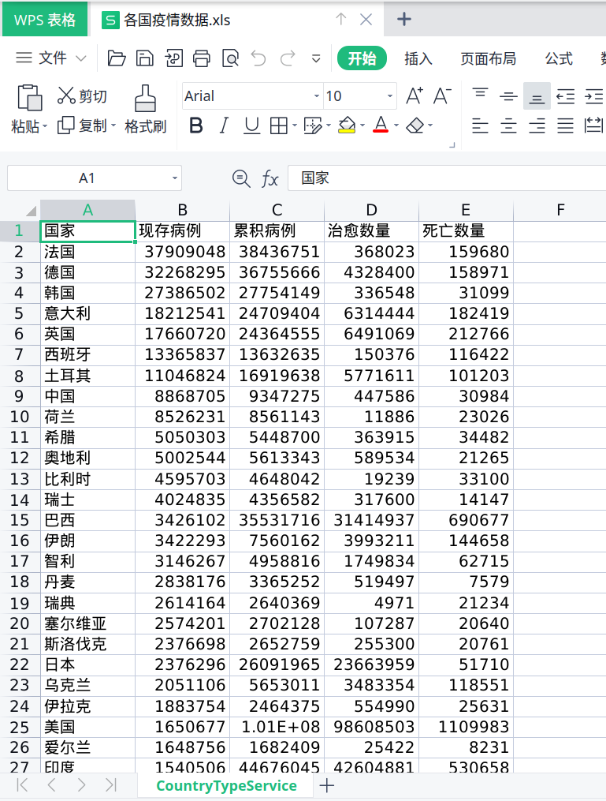
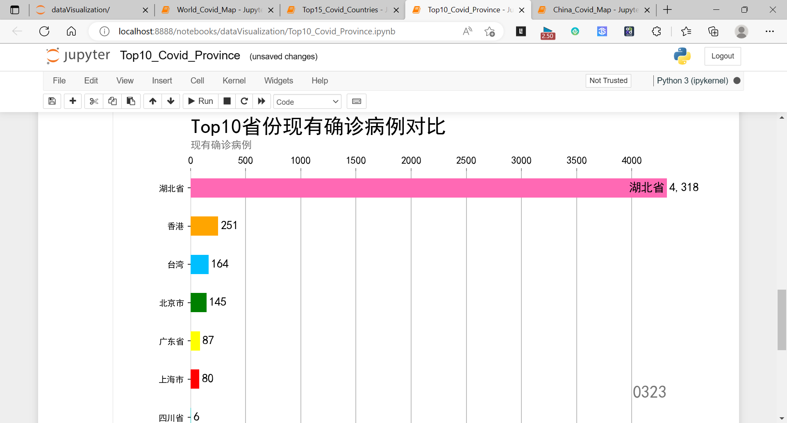

# 新冠疫情数据爬取程序文档说明

---
 **ps：由于数据源自2022年12月17日起不再提供服务，故本程序数据来源于2022年12月11日的存档(即：data目录下的四个json文件)**

---

## 数据源
- 丁香园：<https://ncov.dxy.cn/ncovh5/view/pneumonia>(现已停止服务)

## 程序功能
- 爬取自2020年1月22日的全球各国疫情数据 (生成文件：[data/corona_virus.json](data/corona_virus.json))
- 爬取自2020年1月22日的全国各城市疫情数据 (生成文件：[data/corona_virus_of_china.json](data/corona_virus_of_china.json))
- 爬取今日全球疫情数据 (生成文件：[data/last_day_corona_virus.json](data/last_day_corona_virus.json))
- 爬取今日全国疫情数据 ([data/last_day_corona_virus_of_china.json](data/last_day_corona_virus_of_china.json))
- 全球疫情可视化
- 全国疫情可视化
- 全球疫情动态发展可视化
- 全国疫情动态发展可视化

## 依赖库
- **requests**：用于向目标网页发送请求
- **bs4**：用于解析html网页代码
- **re**：用于正则表达式匹配
- **json**：用于处理json文件
- **xlwt**：用于写入excel文件
- **tqdm**：用于显示进度条
- **pyplot**：交互模式，实现动态显示图像
- **pandas**：获取时间数据
- **numpy**：科学计算库
- **matplotlib**：用于图形绘制
- **mpl_toolkits.basemap**：用于绘制地图框架
- **pylab**：用于显示字体
- **cartopy**：用于下载地图数据

## 执行方法
程序的执行方法可以分为以下四步：**网页获取**，**字符串处理**，**数据处理**，**数据存储**，**数据可视化**

### 详细说明

- **网页获取**：使用requests库向目标网页发送请求获取网页源代码，再使用bs4库解析网页源代码
- **字符串处理**：使用json库处理网页获取的json字符串，将其转换为python文件。
- **数据处理**：使用re库进行正则表达式匹配，获取目标数据的列表。
- **数据存储**：采用循环的形式，使用xlwt库将数据存储至excel表格
- **数据可视化**：
  - 从json文件中读取世界现有确诊病例数据
  - 从shapereader库中获取国家地理信息
  - 使用plt库绘制画布与坐标系
  - 使用rgb2hex库根据获取的确诊病例数据和国家地理信息对地图进行填色
  - 在动态图中使用plt库函数绘制条形图，不断获取每一天的数据进行绘制，通过animation实现动态可视化

## 效果展示

### 数据存储
世界各国的疫情数据：

图1 世界各国疫情数据

中国各城市的疫情数据：

图2 中国各城市疫情数据

### 可视化

世界疫情国家top15：

图3 世界疫情国家top15

中国疫情省市top10：

图4 中国疫情省市top10

世界疫情地图：

图5 世界疫情地图

中国疫情地图：

图6 中国疫情数据